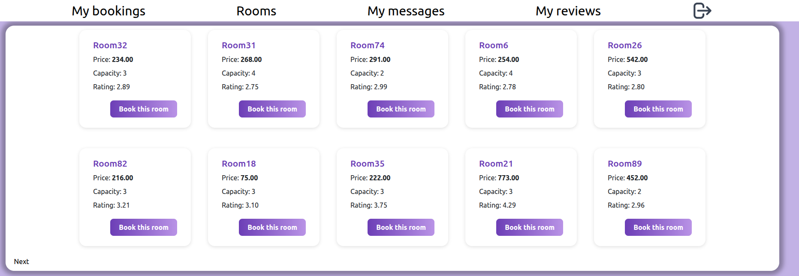
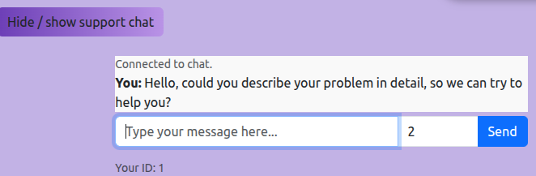
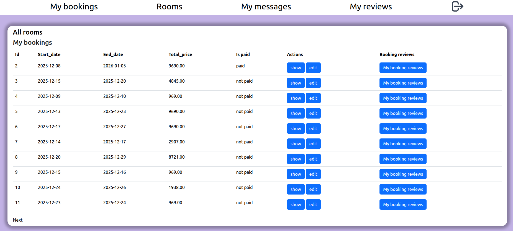
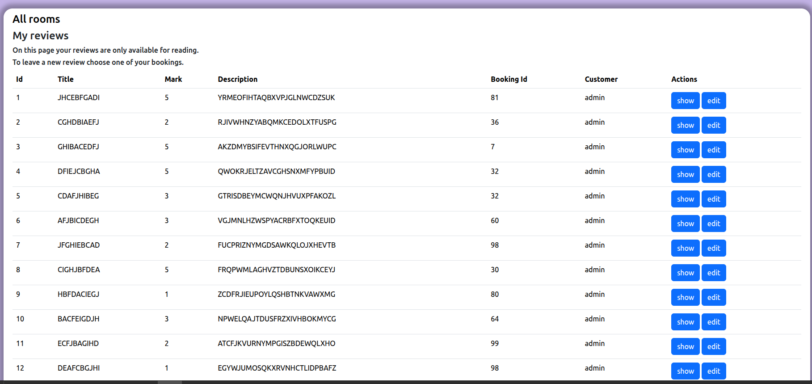
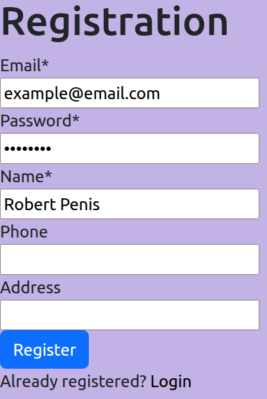
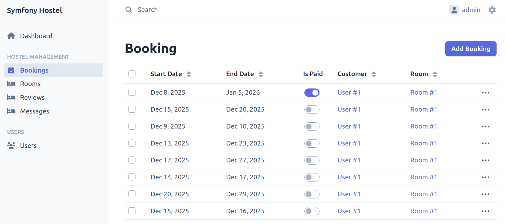
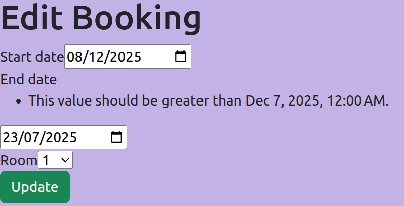
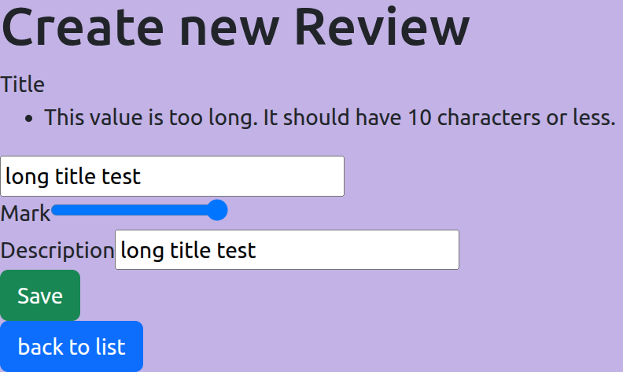
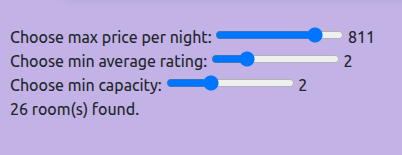

# This repository currently contains 2 branches

1. Simplified local version on branch 'local'<br>
2. Docker based version with mercury websocket chat on default branch 'mercure'<br>

#### 🎬 Quick demo

Switch to the simplified branch:<br>
git checkout local<br>
Start a local server:<br>
php -S localhost:8000 -t public<br>
Then open http://localhost:8000 in your browser to quickly show the app without Docker.

#### 🎬 Full version

Switch to the default branch:<br>
git checkout mercure<br>
Build and run docker:<br>
docker-compose up --build -d

### Main page appearance



### Real time websocket support chat



### Current user bookings



### Current user reviews



### Registration form



### Admin panel



### Validation checks




### Rooms are dynamically filtered



# Symfony Hostel

A simple booking system built with **Symfony 6.4** and **MySQL**.
Users can register, book rooms, and leave reviews. Admins manage everything via a dashboard.

### 🛠 Stack

- PHP 8.1+ & Symfony 6.4
- MySQL
- EasyAdmin Bundle
- Twig + Vanilla JS

---

### 🚀 How to run it

Install PHP, Symfony CLI and Composer <br>

https://symfony.com/doc/current/setup/symfony_cli.html <br>
https://www.php.net/downloads.php <br>
https://getcomposer.org/download/ <br>

1.  **Clone the repository:**

    ```bash
    git clone https://github.com/volodkaly/Symfony_hostel.git
    cd Symfony_hostel
    ```

2.  **Install dependencies:**

    ```bash
    composer install
    ```

3.  **Configure the database:**

    - Create a `.env.local` file (or modify `.env`).
    - Fill in your DB connection parameters.

4.  **Setup the database:**
    ```bash
    php bin/console doctrine:database:create
    php bin/console make:migration
    or symfony console doctrine:migrations:generate
    php bin/console doctrine:migrations:migrate
    ```

---

### 📦 Seeding Data

I created a few console commands to mock the database quickly.<br>
Run them in this specific order to maintain relations:

```
php bin/console addAdmin
php bin/console add100Users
php bin/console addRoom
php bin/console add100Bookings
php bin/console add100Reviews
php bin/console add100Messages

```

#### Without admin u cannot access ~/admin routes for having a control over all enities: room, bookings, reviews, users (customers).

### 📝 Notes

- **Price Calculation:** There is a JS script in the booking form that automatically updates the total price when you change dates.
- **Admin Panel:** You can access it at `/admin`. It handles all the CRUD operations and allows you to toggle payment statuses.
- **Logs:** Custom logs are written when a new booking is created.
- **Flash messages:** Informative msgs ensure attractive UI experience.
- **Pagination:** Long lists divided into pages
- **Validation checks:** User inputs are validated
